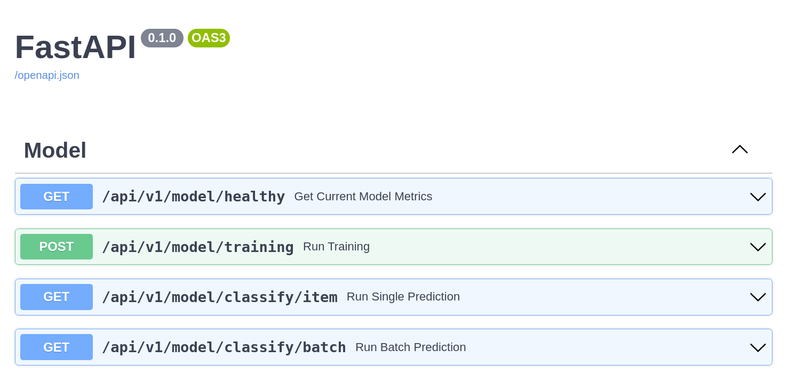

# BNCC Classifier API

This API was build to classify item accordingly the BNCC document. For more information about the project, look the [documentation](https://lucianobatista.github.io/bncc-classifier/).

# Installation

To run this project on your local machine, you need to follow some steps:

1. clone the project to a local directory
2. install `docker` and `docker-compose`
3. give privileges to the entrypoint.sh file, typing (from the command line): `sudo chmod +x entrypoint.sh`
4. run: `docker-compose up --build -d`
5. follow the logs, to see if everything was build correctly: `docker-compose logs -f`

If everything goes fine, you'll see an swagger page on the following link: [http://127.0.0.1:8000/docs#/](http://127.0.0.1:8000/docs#/).

